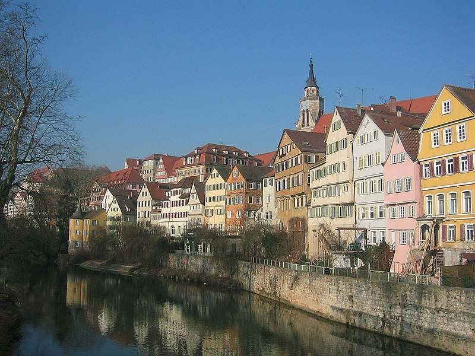
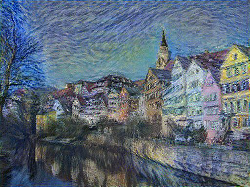
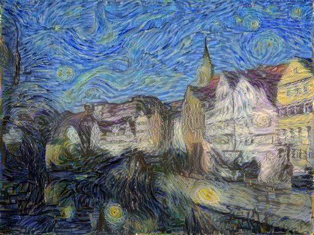
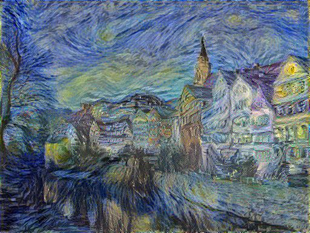
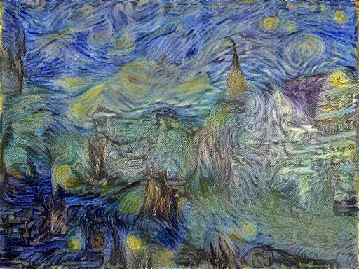
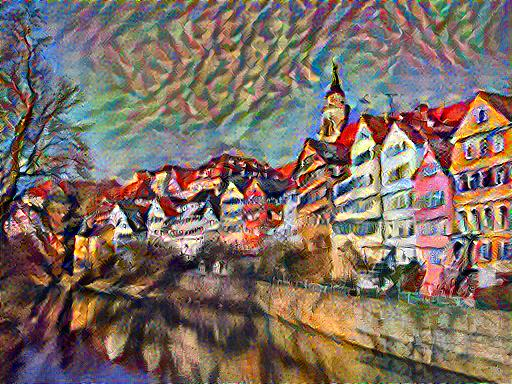
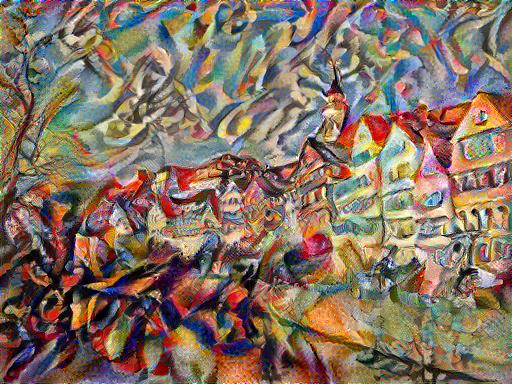
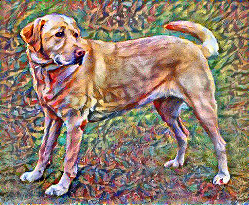
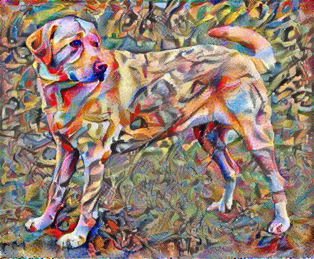

# neural-style-transfer
Tensorflow implementation of the paper [Image Style Transfer Using Convolutional Neural Networks](http://www.cv-foundation.org/openaccess/content_cvpr_2016/papers/Gatys_Image_Style_Transfer_CVPR_2016_paper.pdf).

This is an easy-to-understand, single file implementation of neural style transfer idea.

Content and style losses and layers are as in the paper.\
Variational loss for preventing high frequency artifacts is added.\
Adam optimizer is used instead of L-BFGS. see [this](https://www.reddit.com/r/MachineLearning/comments/5yjfm5/picking_an_optimizer_for_style_transfer/?utm_source=share&utm_medium=web2x&context=3). RMSprop and SGD do not give visually appealing results.

Fine tuning of optimizer hyperparameters, alpha/beta ratio, and variational loss weight is needed for desired output. 

### Usage

 + initialization: content image(default), white noise
 + iterations : 1000 (500 is enough to get visually appeling output)
 + maximum image height(width) : 512
 + alpha/beta : 1e-4 (highly experimental depending on content and style images)
 + variation loss weight: 30

### Samples

### TODO
- vgg weight scaling as in section 2
- argument parsing
