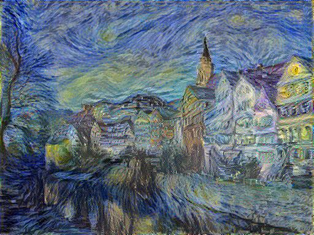

# neural-style-transfer
Tensorflow implementation of the paper 'Image Style Transfer Using Convolutional Neural Networks'

### Description
Easy-to-understand, one file implementation of neural style transfer idea.

### Comments
needs lots of fine tuning

### TODO
- vgg weight scaling as in section 2
- adaptive weighting of different style layers
- command line argument passing
